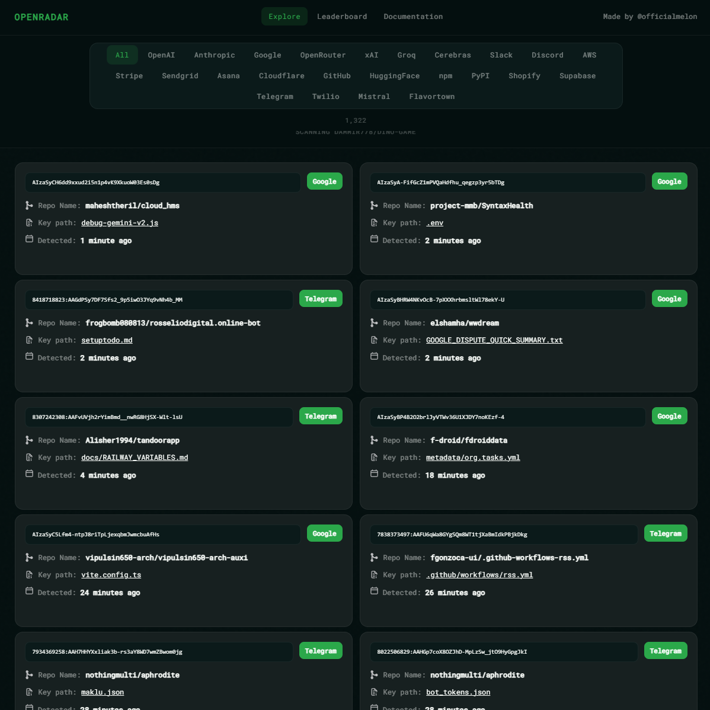
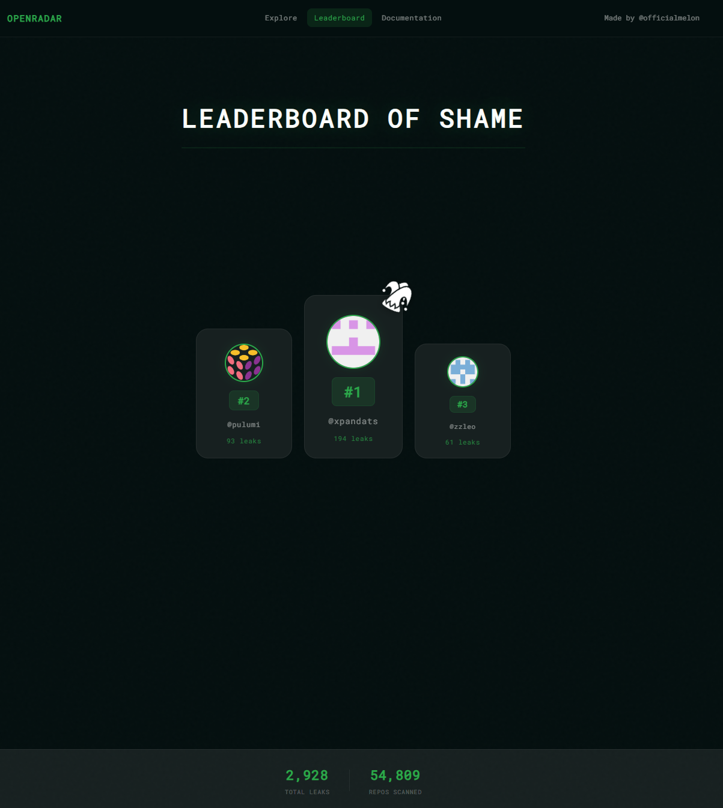
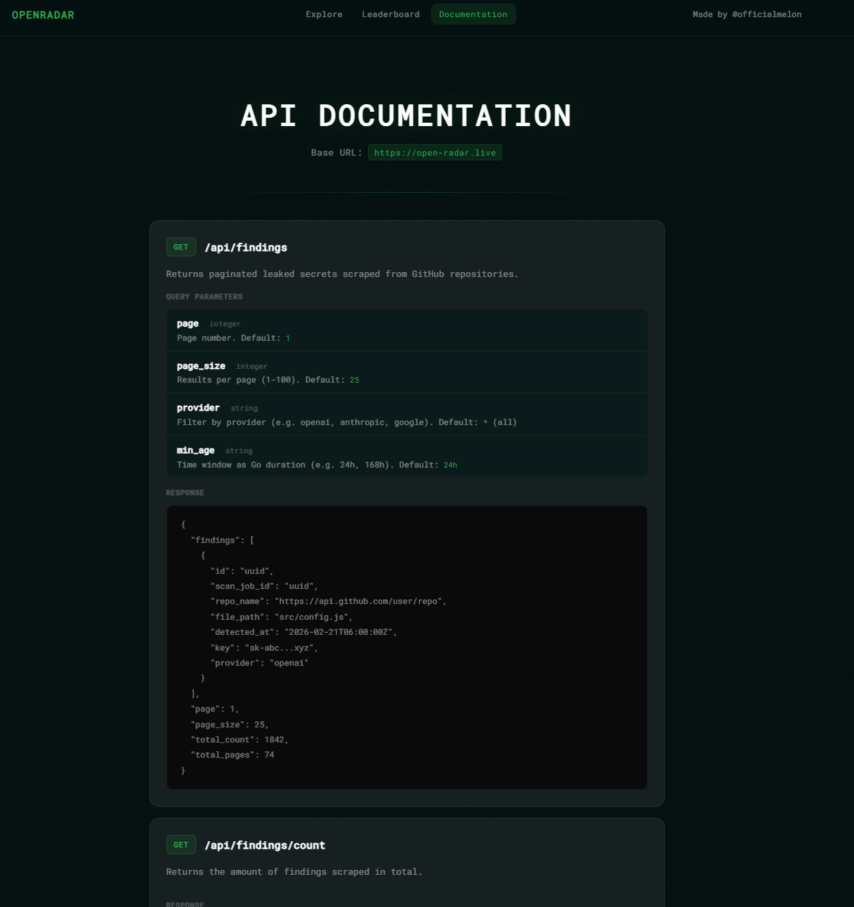

<p align="center">
  
</p>

<h1 align="center">OpenRadar</h1>
<p align="center">A GitHub leak scanning tool</p>

---

## What is OpenRadar?

OpenRadar scans GitHub repositories and commits in real-time to detect accidentally pushed credentials and secrets.

## Screenshots





## Self-Hosting

### Requirements

- Go 1.26+
- Node.js 22.20.0+
- PostgreSQL

### Setup

**1. Clone the repository**
```bash
git clone https://github.com/officialmelon/openradar.git
cd openradar
```

**2. Install dependencies**
```bash
cd app && npm install && cd ..
go mod download
```

**3. Configure environment**

Copy the example `.env` file and fill in your credentials:

- `DATABASE_URL` - your PostgreSQL connection string
- `GITHUB_TOKEN` - generate one from [GitHub Developer Settings](https://github.com/settings/tokens)

**4. Start the server**
```bash
go run cmd/server/main.go
```

The app will be available at [localhost:8080](http://localhost:8080) (or the port specified in your `.env`).

## API Documentation

Full API docs are available at [open-radar.live/docs](https://open-radar.live/docs).

## Disclaimer

This project is for educational and informational purposes only. The author is not liable for any misuse or damage arising from this tool.

## Credits


Built by [@officialmelon](https://github.com/officialmelon). Inspired by [apiradar.live](https://apiradar.live) — check them out!
